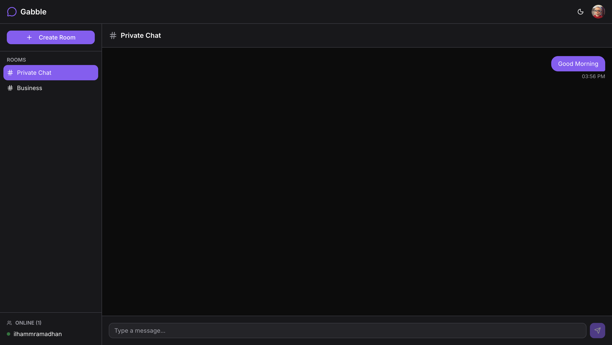
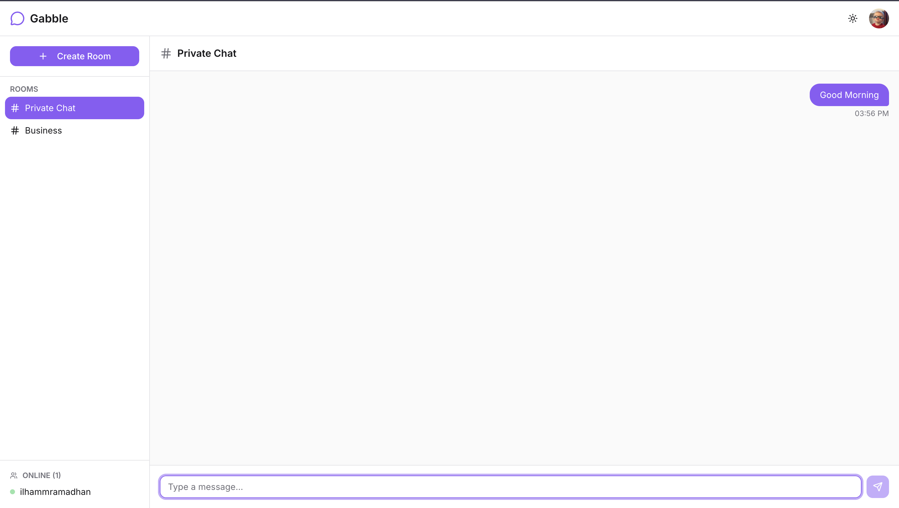

# Gabble

A real-time chat application with public rooms, built with Go and Next.js.


## Live Demo

**[gabble-chi.vercel.app](https://gabble-chi.vercel.app)**

## Screenshots

<p align="center">
  
  <br>
  <em>Dark Mode</em>
</p>

<p align="center">
  
  <br>
  <em>Light Mode</em>
</p>

## Features

- **Real-time Messaging** - WebSocket-powered instant message delivery
- **Public Chat Rooms** - Create and join rooms to chat with others
- **GitHub OAuth** - Secure authentication with GitHub
- **Typing Indicators** - See when others are typing
- **Online Status** - View who's online in each room
- **Dark/Light Mode** - Toggle between themes
- **Persistent Messages** - Chat history saved to PostgreSQL

## Tech Stack

### Backend
- [Go](https://golang.org/) - Backend language
- [Chi](https://github.com/go-chi/chi) - HTTP router
- [Gorilla WebSocket](https://github.com/gorilla/websocket) - WebSocket implementation
- [pgx](https://github.com/jackc/pgx) - PostgreSQL driver
- [JWT](https://github.com/golang-jwt/jwt) - Authentication tokens

### Frontend
- [Next.js 14](https://nextjs.org/) - React framework
- [TypeScript](https://www.typescriptlang.org/) - Type safety
- [Tailwind CSS](https://tailwindcss.com/) - Styling
- [shadcn/ui](https://ui.shadcn.com/) - UI components
- [next-themes](https://github.com/pacocoursey/next-themes) - Theme switching

### Infrastructure
- [Railway](https://railway.app/) - Backend hosting
- [Vercel](https://vercel.com/) - Frontend hosting
- [Neon](https://neon.tech/) - PostgreSQL database

## Getting Started

### Prerequisites

- Go 1.21+
- Node.js 18+
- PostgreSQL database

### Backend Setup

```bash
cd backend

# Copy environment variables
cp .env.example .env

# Edit .env with your values
# DATABASE_URL=postgres://...
# GITHUB_CLIENT_ID=...
# GITHUB_CLIENT_SECRET=...
# JWT_SECRET=...

# Install dependencies
go mod download

# Run the server
go run cmd/server/main.go
```

### Frontend Setup

```bash
cd frontend

# Copy environment variables
cp .env.example .env.local

# Edit .env.local
# NEXT_PUBLIC_API_URL=http://localhost:8080

# Install dependencies
npm install

# Run development server
npm run dev
```

Open [http://localhost:3000](http://localhost:3000) to view the app.

## Project Structure

```
gabble/
├── backend/
│   ├── cmd/
│   │   └── server/
│   │       └── main.go          # Entry point
│   ├── internal/
│   │   ├── config/              # Environment config
│   │   ├── database/            # PostgreSQL + repositories
│   │   ├── handlers/            # HTTP & WebSocket handlers
│   │   ├── middleware/          # JWT auth middleware
│   │   ├── models/              # User, Room, Message
│   │   └── websocket/           # Hub, Client, Events
│   ├── go.mod
│   └── go.sum
│
└── frontend/
    ├── src/
    │   ├── app/
    │   │   ├── globals.css      # Theme colors
    │   │   ├── layout.tsx       # Root layout
    │   │   ├── page.tsx         # Main page
    │   │   └── providers.tsx    # Theme provider
    │   ├── components/
    │   │   ├── chat/            # Message components
    │   │   ├── sidebar/         # Room list
    │   │   └── ui/              # shadcn/ui
    │   ├── hooks/
    │   │   ├── use-auth.ts      # Authentication
    │   │   └── use-websocket.ts # WebSocket connection
    │   └── lib/
    │       ├── api.ts           # API client
    │       └── types.ts         # TypeScript types
    ├── package.json
    └── tailwind.config.ts
```

## API Endpoints

### Authentication
| Method | Endpoint | Description |
|--------|----------|-------------|
| GET | `/auth/github` | Initiate GitHub OAuth |
| GET | `/auth/github/callback` | OAuth callback |
| GET | `/api/auth/me` | Get current user |

### Rooms
| Method | Endpoint | Description |
|--------|----------|-------------|
| GET | `/api/rooms` | List all rooms |
| POST | `/api/rooms` | Create a room |
| GET | `/api/rooms/:id` | Get room details |
| DELETE | `/api/rooms/:id` | Delete room (owner only) |
| GET | `/api/rooms/:id/messages` | Get message history |

### WebSocket
| Event | Direction | Description |
|-------|-----------|-------------|
| `join_room` | Client → Server | Join a chat room |
| `leave_room` | Client → Server | Leave current room |
| `send_message` | Client → Server | Send a message |
| `typing` | Client → Server | Typing indicator |
| `message` | Server → Client | New message |
| `user_joined` | Server → Client | User joined room |
| `user_left` | Server → Client | User left room |
| `online_users` | Server → Client | Online users list |

## Deployment

### Backend (Railway)

1. Create account at [railway.app](https://railway.app)
2. Create new project → Deploy from GitHub repo
3. Set root directory to `backend`
4. Add environment variables:
   - `DATABASE_URL`
   - `GITHUB_CLIENT_ID`
   - `GITHUB_CLIENT_SECRET`
   - `JWT_SECRET`
   - `FRONTEND_URL`
5. Generate domain in Settings → Networking

### Frontend (Vercel)

1. Push to GitHub
2. Import project in Vercel
3. Set root directory to `frontend`
4. Set environment variable: `NEXT_PUBLIC_API_URL`
5. Deploy

### Database (Neon)

1. Create account at [neon.tech](https://neon.tech)
2. Create new project
3. Copy connection string to backend's `DATABASE_URL`

## Environment Variables

### Backend
| Variable | Description |
|----------|-------------|
| `PORT` | Server port (default: 8080) |
| `DATABASE_URL` | PostgreSQL connection string |
| `GITHUB_CLIENT_ID` | GitHub OAuth app client ID |
| `GITHUB_CLIENT_SECRET` | GitHub OAuth app secret |
| `JWT_SECRET` | Secret for signing JWT tokens |
| `FRONTEND_URL` | Frontend URL for CORS & redirects |

### Frontend
| Variable | Description |
|----------|-------------|
| `NEXT_PUBLIC_API_URL` | Backend API URL |

## License

MIT
